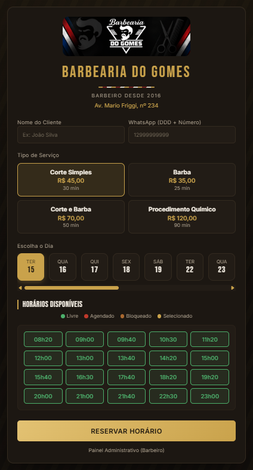
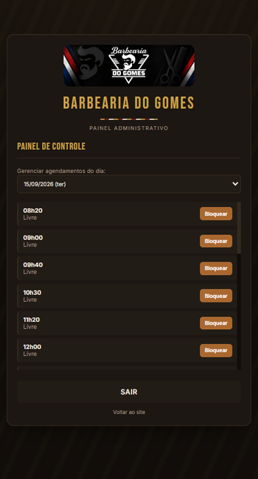

<div align="center">

# 💈 Barbearia do Gomes — Sistema de Agendamento

</div>

Aplicação web para gerenciamento de agendamentos de barbearia, com painel administrativo, confirmação via WhatsApp e persistência em tempo real com Firebase Firestore.

<p align="center">
  
  
</p>

## Visão Geral

O sistema permite que clientes realizem agendamentos de forma simples e intuitiva, enquanto o administrador possui controle completo sobre horários, bloqueios e atendimentos — tudo em duas páginas independentes (site do cliente e painel administrativo).

## Funcionalidades

### Cliente
- Cadastro de nome (aceita apenas letras) e WhatsApp (aceita apenas números)
- Seleção de serviços, com duração variável por serviço
- Escolha de datas disponíveis (próximos dias úteis, excluindo domingo e segunda)
- Visualização de horários livres, ocupados e bloqueados em tempo real
- Bloqueio automático de reagendamento do mesmo serviço em menos de 7 dias
- Aviso de confirmação via WhatsApp após o agendamento

### Administrador (`admin.html`)
- Login dedicado, separado do site do cliente
- Visualização completa dos agendamentos do dia selecionado
- Bloqueio e liberação de horários
- Cancelamento de agendamentos, com modal de confirmação próprio (sem pop-up nativo do navegador)
- Envio manual de confirmação ao cliente via WhatsApp (link direto, sem custo de API)

## Tecnologias Utilizadas

- HTML5 / CSS3 (design system próprio, sem frameworks de UI)
- JavaScript (ES Modules)
- Firebase Firestore (banco de dados em tempo real)
- Vercel Serverless Functions (`/api`)
- UltraMsg (opcional — envio automático de WhatsApp)

## Estrutura do Projeto

```
├── index.html               # Site do cliente (agendamento)
├── admin.html                # Painel administrativo (login + gestão)
├── css/
│   └── style.css              # Estilos (paleta, componentes, modal)
├── js/
│   ├── firebase.js             # Configuração do Firebase (compartilhada)
│   ├── app.js                   # Lógica do site do cliente
│   └── admin.js                  # Lógica do painel administrativo
├── api/
│   ├── admin-login.js           # Autenticação do painel administrativo
│   └── whatsapp.js               # Envio automático de confirmação via UltraMsg
├── docs/                     # Imagens usadas neste README
├── logo.png                  # Logo usada no cabeçalho das duas páginas
├── .env.example              # Modelo de variáveis de ambiente
└── .gitignore
```

## Regras de Negócio

- Um cliente não pode agendar o mesmo serviço com intervalo inferior a 7 dias
- Serviços possuem duração variável e ocupam múltiplos horários consecutivos
- Horários podem estar em três estados: Livre, Agendado ou Bloqueado

## Como Executar

1. Clone o repositório:
   ```bash
   git clone https://github.com/marcusguarani/barbearia-do-gomes.git
   cd barbearia-do-gomes
   ```

2. Crie seu arquivo `.env` a partir do modelo:
   ```bash
   cp .env.example .env
   ```
   Preencha `API_SECRET` e `ADMIN_CREDENTIALS` com seus próprios valores. `ULTRAMSG_INSTANCE` e `ULTRAMSG_TOKEN` são opcionais — sem eles, o agendamento funciona normalmente, só a confirmação automática por WhatsApp não é enviada (o botão manual no painel admin continua funcionando, sem custo).

3. Instale as dependências e rode com o Vercel CLI (necessário para as funções em `/api`):
   ```bash
   npm install
   npm install -g vercel
   npx vercel dev
   ```

4. Acesse `http://localhost:3000` (site do cliente) e `http://localhost:3000/admin.html` (painel administrativo).

## ⚠️ Nota sobre segurança

Este projeto usa uma chave (`x-api-key`) para proteger o endpoint `/api/whatsapp`. Como essa chave fica no JavaScript do cliente, ela é visível a qualquer pessoa que inspecione o código da página — ou seja, funciona como uma barreira simples contra automações triviais, mas não como uma autenticação real. O endpoint já conta com um rate limit básico por telefone; para produção, vale reforçar com validação de origem (Origin/Referer) no back-end.

O login do painel administrativo também não gera uma sessão persistente — é uma checagem pontual no momento do login. Se as regras de segurança do Firestore estiverem abertas, agendamentos podem ser lidos/gravados diretamente pelo console do navegador, com ou sem login. Vale revisar as regras do Firestore antes de usar em produção.

## 👤 Autor

**Marcus Guarani**

[](https://github.com/marcusguarani)
[](https://www.linkedin.com/in/marcusguarani)
[](https://marcusguarani.com.br)

## 📄 Licença

Este projeto está sob a licença MIT. Sinta-se livre para usar, estudar e modificar.
